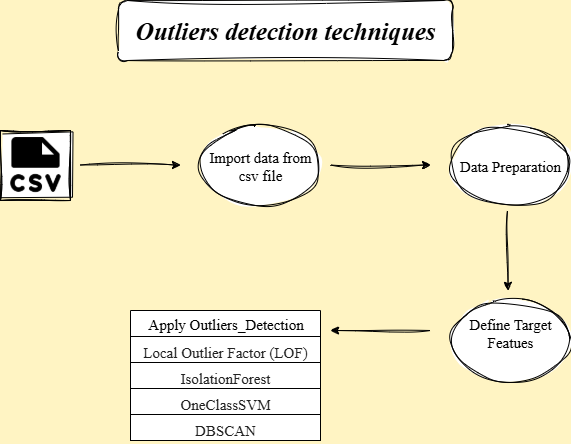

# *Outliers_detection_techniques*


## *How to run ?*

*Clone the repository:*

```bash
https://github.com/omars1234/Outliers_detection_techniques.git
```

```bash
conda create --name EnvOutliers_detection python=3.8.2 -y
```

```bash
conda activate EnvOutliers_detection
```

```bash
pip install -r requirements.txt
```

## *Project Structure :*

